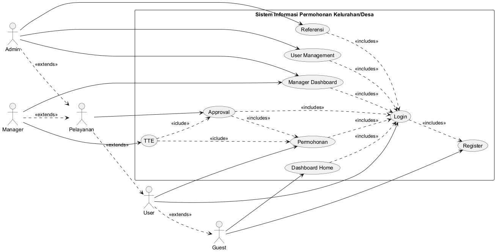
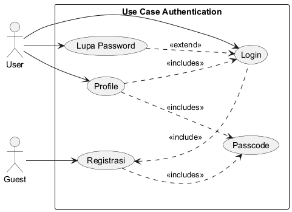
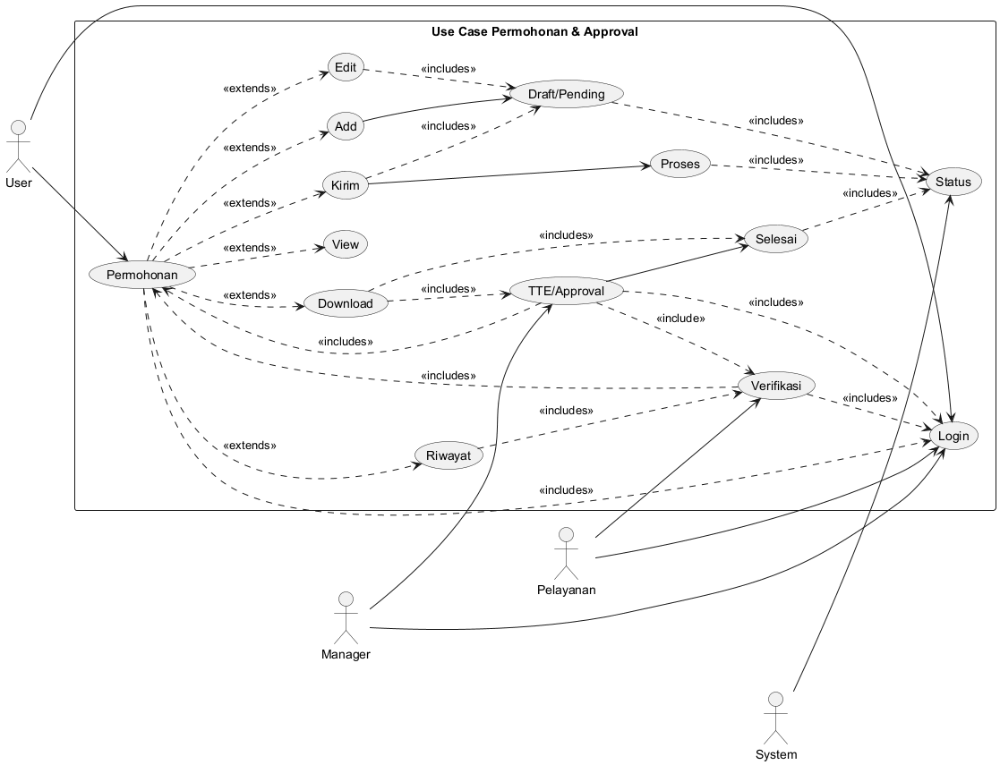

# Daftar Isi

- [Daftar Isi](#daftar-isi)
- [Aplikasi SIMKEL](#aplikasi-simkel)
  - [Maksud dan Tujuan](#maksud-dan-tujuan)
    - [Tujuan](#tujuan)
  - [Pengguna aplikasi (Aktor)](#pengguna-aplikasi-aktor)
    - [Pengunjung](#pengunjung)
    - [Pengunjung Terdaftar](#pengunjung-terdaftar)
    - [Manager](#manager)
      - [Kepala Daerah](#kepala-daerah)
      - [Camat](#camat)
      - [Lurah/Kepala Desa](#lurahkepala-desa)
    - [Petugas Pelayanan](#petugas-pelayanan)
    - [Administrator](#administrator)
  - [Module Aplikasi](#module-aplikasi)
    - [Dashboard](#dashboard)
      - [Pengunjung](#pengunjung-1)
      - [Pengunjung Terdaftar](#pengunjung-terdaftar-1)
      - [Petugas](#petugas)
      - [Lurah](#lurah)
      - [Camat](#camat-1)
      - [Kepala Daerah](#kepala-daerah-1)
    - [Authentication (Login)](#authentication-login)
    - [Registrasi](#registrasi)
      - [Element Data](#element-data)
    - [Profile](#profile)
      - [Element Data](#element-data-1)
    - [Permohoan](#permohoan)
      - [Element Data](#element-data-2)
    - [Verifikasi](#verifikasi)
      - [Element Data Verifikasi](#element-data-verifikasi)
    - [Riwayat berkas](#riwayat-berkas)
  - [Use Case](#use-case)
    - [Use Case Simkel](#use-case-simkel)
    - [Use Case Auth](#use-case-auth)
    - [Use Case Permohonan](#use-case-permohonan)

# Aplikasi SIMKEL

## Maksud dan Tujuan

### Tujuan

1. Memudahkan masyarakat dalam mengajukan permohonan surat keterangan dan dapat mencetak surat permohonan secara mandiri
2. Memudahkan bagian pelayanan dalam memeriksa dan meneruskan permohonan kepada level berikutnya
3. Memudahkan pejabat berwenang dapat menyetujui dan menandatangani dimanapun berada sehingga pelayanan kepada masyarakat tidak dibatasi.

## Pengguna aplikasi (Aktor)

 1. Pengunjung
 1. Pengunjung Terdaftar
 2. Manager
    1. Kepala Daerah
    2. Camat
    3. Lurah/Kepala Desa
 3. Petugas Pelayanan
 4. Administrator

### Pengunjung

Dapat melihat kinerja pemerintah daerah dalam melayani masyarakat melalu dashboard

### Pengunjung Terdaftar

- Hak Sebagai pengunjung
- Membuat Permohonan
- Memperbaiki Permohonan
- Mengirim Permohonan
- Melihat Status Permohonan
- Mencetak Permohonan Selesai
  
### Manager  
#### Kepala Daerah

- Hak sebagai pengunjung terdaftar
- Dapat melihat kinerja pejabat (Camat dan Lurah/Kepala Desa)

#### Camat

- Hak sebagai pengunjung terdaftar
- Dapat melihat kinerja Lurah/Kepala Desa di wilayahnya
- Menyetujui dan menandatangani permohonan

#### Lurah/Kepala Desa

- Hak sebagai pengunjung terdaftar
- Dapat melihat kinerja Petugas Pelayanan di wilayahnya
- Menyetujui dan menandatangani permohonan

### Petugas Pelayanan

- Hak sebagai pengunjung terdaftar
- Melihat berkas masuk 
- Memverifikasi berkas
- Meneruskan/Menyetujui berkas

### Administrator
- Hak sebagai pengunjung terdaftar
- Mengelola referensi
- Mengelola user

## Module Aplikasi

1. Authentication (Login)
1. Registrasi
1. Dashboard
1. Permohoan
1. Approval
2. Management User
3. Referensi

### Dashboard
Module ini digunakan untuk menampilkan data statistik permohonan pada tahun berjalan berdasarkan status

#### Pengunjung
1. Dalam Proses
1. Pending
1. Disetujui
1. Ditolak

#### Pengunjung Terdaftar
- Akses Pengunjung
- Status permohonan

#### Petugas 
- Akses Pengunjung Terdaftar
- Statistik Proses

#### Lurah
- Akses dashboard Petugas
- Dashboard Kelurahan

#### Camat
- Akses Lurah
- Dashboard Kecamatan

#### Kepala Daerah
- Akses Camat
- Dashboard Kecamatan

### Authentication (Login)
Digunakan untuk masuk ke aplikasi
1. Menggunakan user password
2. Google OAuth
   
### Registrasi
Registrasi digunakan untuk mendapatkan account login ke system dalam hal registrasi juga mendukung Google OAuth.
#### Element Data
* Email
* User Name
* Password
* Confirm Password
* Passcode

### Profile
Profile digunakan untuk mendata identitas user yang akan mengajukan permohonan

#### Element Data
* NIK
* Nama
* Alamat 
* Kelurahan
* Kecamatan
* Kota
* Provinsi
* Kartu Identitas

### Permohoan
Digunakan untuk membuat, melihat, memperbaiki, mengirim dan download data permohonan.

#### Element Data
* Element Data Profile
* Jenis Permohonan
* Data Pendukung sesuai dengan Jenis Permohonan
* Status Permohonan
  * draft (0)
  * proses (1)
  * pending (2)
  * approve (3)
  * reject (4)

### Verifikasi
Berfungsi untuk memverifikasi, menyetujui, pending dan menolak permohonan. Verifikasi ini juga berfungsi untuk menandatangani secara elektronik.

#### Element Data Verifikasi
* Tgl Proses
* Jenis 
  * new
  * edited
  * pending
  * process
  * approved
  * rejected
* User
* Permohonan
* Next Approval

Saat ditolak status permohonan akan tetap berada pada posisi akhir penolak.

### Riwayat berkas
Merupakan laporan proses sejak dibuat sampai dengan ditolak/di tanda tangan

## Use Case
### Use Case Simkel

### Use Case Auth

### Use Case Permohonan

